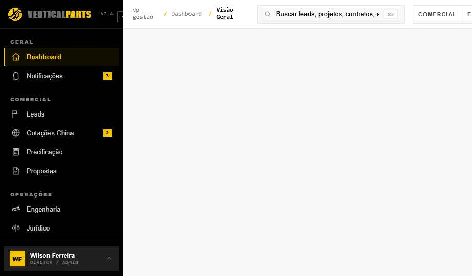

# VP Gestão — VerticalParts ERP Frontend

> **Status:** 🎨 Protótipo de Design · Dados mockados · Sem backend · Em preparação para integração com Supabase



---

## O que é este projeto

**VP Gestão** é o frontend completo do sistema de gestão da **VerticalParts** — empresa especializada em peças e modernização de elevadores, escadas rolantes e esteiras.

O sistema cobre todo o ciclo comercial e operacional da empresa: desde a entrada de leads até o fechamento financeiro, passando por cotações internacionais (China), precificação, propostas comerciais, engenharia, NCM fiscal, importação e logística.

Este repositório contém o **protótipo de design em React** — interface completa, fiel ao design system da VP, com dados mockados realistas. O próximo passo é substituir o `src/data.js` por chamadas reais ao Supabase.

---

## Módulos implementados (16 telas)

| Grupo | Módulo | Perfis com acesso |
|---|---|---|
| **Geral** | Dashboard (KPIs + Gantt + Alertas) | Todos |
| **Geral** | Notificações / Central de Alertas | Todos |
| **Comercial** | Leads (CRM) | Todos |
| **Comercial** | Cotações China | Todos |
| **Comercial** | Precificação (calculadora de margem) | Financeiro, Admin |
| **Comercial** | Propostas (lista + editor completo) | Todos |
| **Operações** | Engenharia (laudos técnicos + Gantt) | Todos |
| **Operações** | Solicitações NCM (Kanban fiscal) | Todos |
| **Operações** | Jurídico (contratos) | Todos |
| **Operações** | Instalação (checklist de obras) | Todos |
| **Logística** | Importação (embarques + mapa de navios) | Todos |
| **Logística** | Catálogo de Produtos (NCM search) | Todos |
| **Logística** | Compras Nacional | Todos |
| **Financeiro** | Gatilhos & Prazo | Financeiro, Admin |
| **Financeiro** | Comissões | Financeiro, Admin |
| **Admin** | Configurações | Admin |

---

## Perfis de usuário (Role-Based Access)

| Role | Representa | Acesso |
|---|---|---|
| `comercial` | Letícia Magalhães (Comercial Sr.) | Módulos Comercial + Operações + Logística |
| `engenharia` | Daniel Otsuka (Eng. Comercial) | Idem |
| `financeiro` | Cláudia Bertolini (Gerente Financeiro) | + Precificação, Gatilhos, Comissões |
| `admin` | Wilson Ferreira (Diretor / Admin) | Acesso total |

O seletor de perfil fica no header — ao trocar, KPIs, menus e telas restritas se ajustam automaticamente.

---

## Stack técnica

| Camada | Tecnologia |
|---|---|
| UI | React 18.3.1 (UMD) + Babel Standalone 7.29.0 |
| Estilo | CSS custom properties (design system VP) |
| Ícones | SVG inline (estilo Lucide, stroke 1.6) |
| Dados | `src/data.js` + `src/ncm-data.js` (mock window globals) |
| Print | Segundo entry point `index-print.html` para PDF |
| Backend (futuro) | Supabase — `jxtqwzmpgofwctqajewt` |
| Hosting (futuro) | A definir após integração backend |

> ⚠️ Sem build step — o navegador compila JSX via Babel no runtime. Adequado para protótipo; para produção, substituir por Vite + build estático.

---

## Como rodar localmente

```bash
# Não precisa de npm/node — é HTML estático
# Abra direto no browser:

# Opção 1: drag-and-drop do index.html no Chrome/Firefox
# Opção 2: servidor local mínimo
npx serve .
# ou
python -m http.server 3000
```

Acesse `http://localhost:3000` e troque de perfil pelo seletor no header.

---

## Estrutura de arquivos

```
vpprd_claudeDesigner/
├── index.html               # Entry principal (app completo)
├── index-print.html         # Entry para geração de PDF de propostas
├── colors_and_type.css      # Tokens de cor e tipografia (design system)
│
├── assets/                  # Logos e imagens de produtos
│   ├── logo-mark-yellow.png
│   ├── logo-verticalparts-white.png
│   ├── capa-elevador.png
│   ├── capa-escada-rolante.png
│   └── capa-esteira-rolante.png
│
├── styles/
│   ├── app.css              # Layout global, sidebar, header, primitivos
│   ├── modules.css          # Estilos de cada módulo
│   ├── proposta-editor.css  # Editor de proposta (3 abas + preview)
│   ├── ncm.css              # Kanban NCM + catálogo
│   └── print.css            # Estilos de impressão/PDF
│
├── src/
│   ├── data.js              # Mock data: leads, cotações, projetos, embarques...
│   ├── ncm-data.js          # Catálogo NCM de peças VP
│   ├── app.jsx              # Roteamento + estado global (role, route)
│   ├── shell.jsx            # Sidebar + Header + role switcher
│   ├── primitives.jsx       # Componentes base (Button, Card, Modal, Badge...)
│   ├── toast.jsx            # Sistema de notificações toast
│   ├── tweaks-panel.jsx     # Painel de ajustes de design (density, etc.)
│   ├── dashboard.jsx        # Dashboard: KPIs, Gantt, Alertas, Tasks
│   ├── comercial.jsx        # Leads CRM + Cotações China
│   ├── precificacao.jsx     # Calculadora de margem e pricing
│   ├── proposta-form.jsx    # Formulário de criação de proposta
│   ├── proposta-preview.jsx # Preview de proposta (PDF-ready)
│   ├── proposta-editor.jsx  # Editor completo 3-abas com sidenav
│   ├── ncm.jsx              # Kanban de solicitações NCM
│   ├── ncm-catalogo.jsx     # Catálogo de produtos com busca NCM
│   ├── operacoes.jsx        # Engenharia, Jurídico, Instalação, Compras
│   ├── logistica.jsx        # Importação, Embarques, Inbox
│   └── financeiro.jsx       # Gatilhos, Comissões, Prazo
│
├── audit/
│   ├── 01-dashboard.png     # Screenshot do dashboard
│   └── cacabugs-relatorio.md # Relatório completo de auditoria (89 checks)
│
└── uploads/                 # Assets de trabalho e documentos de referência
```

---

## Estado atual — Auditoria de qualidade

Auditoria executada em `22/mai/2026` sobre os 14 módulos. Ver relatório completo em [`audit/cacabugs-relatorio.md`](audit/cacabugs-relatorio.md).

```
Score de Qualidade: 64/100
Go/No-Go produção: ❌ No-Go — protótipo demonstrativo

🔴 Críticos  ████ 4      (responsividade, filtros sem handler, search decorativo, CTAs mudos)
🟠 Altos     ██████████ 10
🟡 Médios    ████████████ 12
🔵 Baixos    ████████ 8
⚪ Info      █████ 5
```

**Pontos fortes confirmados:**
- ✅ Role-switching reativo (KPIs + módulos restritos)
- ✅ Editor de Proposta com 3 abas e preview ao vivo
- ✅ Mapa de navios com animação de posição
- ✅ Densidades (compact/cozy/airy) funcionais em todo o app
- ✅ Design system consistente (amarelo/preto/cinza, Barlow Condensed)
- ✅ Gantt chart de projetos por fase

---

## Roadmap — próximos passos

```
Fase 1 — Fixes do protótipo (Sprint 1, ~1 dia)
  ├─ [ ] Filtros segmentados com handler real (Jurídico, Importação, Compras)
  ├─ [ ] Toast genérico para CTAs sem handler ("Ação não disponível neste protótipo")
  ├─ [ ] Auto-collapse sidebar ≤1024px
  ├─ [ ] Search header desabilitado com tooltip "Em breve"
  └─ [ ] Persistência localStorage (navegação + editor de proposta)

Fase 2 — Integração Supabase
  ├─ [ ] Criar tabelas: leads, cotacoes, propostas, projetos, embarques
  ├─ [ ] RLS por perfil (comercial / engenharia / financeiro / admin)
  ├─ [ ] Substituir src/data.js por hooks de fetch ao Supabase
  ├─ [ ] Auth real (Supabase Auth) em vez de role switcher mock
  └─ [ ] Supabase: jxtqwzmpgofwctqajewt.supabase.co

Fase 3 — Build de produção
  ├─ [ ] Migrar de Babel inline → Vite + bundler
  ├─ [ ] Deploy em hospedagem (Hostinger ou Vercel)
  └─ [ ] CI/CD com GitHub Actions
```

---

## Supabase (backend futuro)

| Recurso | Valor |
|---|---|
| Project ID | `jxtqwzmpgofwctqajewt` |
| Project URL | `https://jxtqwzmpgofwctqajewt.supabase.co` |
| Status | Projeto criado, sem tabelas ainda |
| GitHub Repo | `https://github.com/verticalpartsIA/vpprd.git` |

As tabelas serão criadas na Fase 2, após revisão do modelo de dados com base nos módulos do protótipo.

---

## Contexto do produto

**VerticalParts** é uma empresa de São Paulo especializada em:
- Importação e distribuição de peças para elevadores, escadas e esteiras rolantes
- Modernização e retrofit de equipamentos (Schindler, Otis, ThyssenKrupp, Mitsubishi, Kone, Sigma)
- Projetos de instalação e manutenção em condomínios, hospitais, shoppings e aeroportos

O **VP Gestão** centraliza: funil de vendas, cotação internacional, engenharia, conformidade NCM, importação marítima, financeiro e geração de propostas comerciais em PDF.

---

*Projeto interno VerticalParts · Uso restrito · Não publicar credenciais*
